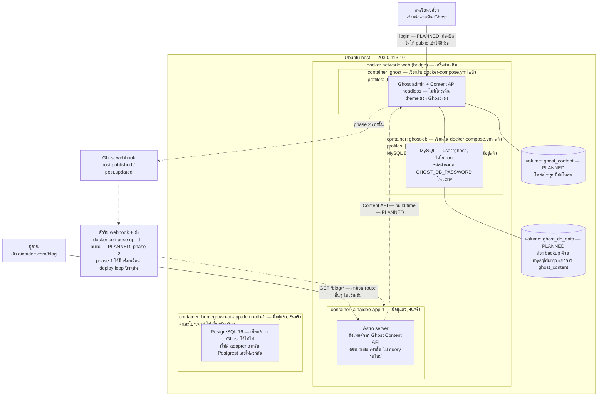
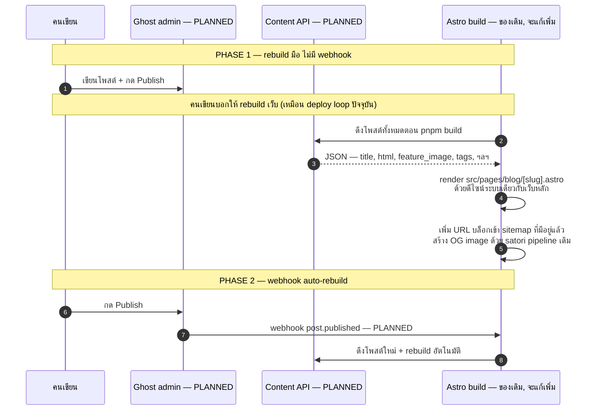
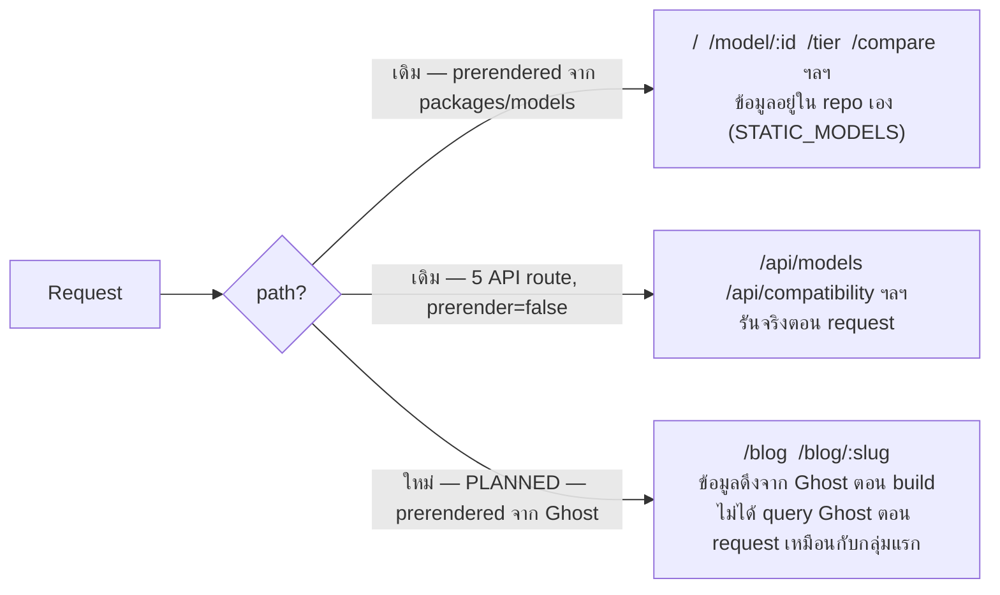

# AiNaiDee — blog architecture

**อัปเดต 2026-07-31: โค้ดฝั่ง Astro (route, OG image, Schema.org) เขียนแล้วและ build ผ่านจริง —
ดูรายละเอียดใน [`blog-plan.md`](./blog-plan.md) หัวข้อ "สิ่งที่ทำแล้ว"** สิ่งที่ diagram นี้ยังทำเครื่องหมาย
"PLANNED"/เส้นประไว้คือส่วนที่ยังไม่ได้ deploy จริง: container `ghost` (เขียนใน `docker-compose.yml`
แล้ว แต่อยู่หลัง `profiles: ["blog"]` ไม่ได้สั่ง `up`), DNS `blog.ainaidee.com`, Ghost admin account,
Caddy site block สำหรับ subdomain, และ webhook auto-rebuild ทั้งหมดนี้บล็อกอยู่ที่การกระทำที่ต้องทำเอง
(สร้างบัญชี, ตั้ง DNS) ไม่ใช่โค้ดที่ยังไม่ได้เขียน

---

## 1. Topology ที่จะเพิ่มเข้าไปในของเดิม

ของเดิม (ตามจริงตอนนี้, phase 1 ของ deploy) คือ `ainaidee-app-1` ตัวเดียว เผยแพร่ตรงที่
`203.0.113.10:8587` ไม่มี Caddy ยังไม่มีอะไรในไดอะแกรมนี้ถูกสร้างเลยสักส่วน — เส้นประ + ป้าย
"PLANNED" ทั้งหมด

**จุดสำคัญ**: `app` ดึงเนื้อหาจาก Ghost **ตอน build** ไม่ใช่ตอนมีคนเข้าเว็บ — เหมือนกับที่ตอนนี้
`ainaidee-app-1` render หน้า static ไว้ล่วงหน้าอยู่แล้ว (ดู diagram 3 ใน `deploy-architecture.md`)
บล็อกโพสต์ก็จะกลายเป็นหน้า static เหมือนหน้าโมเดล ไม่ใช่ query สดทุกครั้ง

---

## 2. เนื้อหาไหลจาก Ghost เข้าเว็บยังไง — PLANNED

---

## 3. Request routing ที่จะเปลี่ยน — เทียบกับ diagram เดิม

`deploy-architecture.md` diagram 3 อธิบาย routing ปัจจุบันไว้แล้ว (prerendered vs 5 API route)
บล็อกเพิ่มกลุ่มที่ 3: **prerendered แต่ข้อมูลมาจากนอกโปรเจกต์**

**บล็อกไม่ได้เพิ่ม route ที่ต้องมีเซิร์ฟเวอร์รันตอน request** — ยังคงเป็น static เหมือนหน้าโมเดล
ต่างกันแค่ "ข้อมูลต้นทาง" มาจาก Ghost แทนที่จะมาจากไฟล์ในโปรเจกต์ ผลคือ **ถ้าไม่มี webhook (phase 1)
เนื้อหาบล็อกจะไม่อัปเดตจนกว่าจะ build ใหม่** — เหมือนการแก้โมเดลใน `packages/models/src/index.ts`
ที่ต้อง build ใหม่ถึงจะขึ้นเว็บ

---

## สิ่งที่ตัดสินใจแล้ว vs สิ่งที่ยังต้องตัดสินใจ

ตัดสินใจแล้ว (2026-07-31, รายละเอียดเหตุผลใน [`blog-plan.md`](./blog-plan.md)):
**MySQL** (เปลี่ยนจาก SQLite ตอนแรก, และไม่ใช่ Postgres ตัวที่มีอยู่แล้วบนเครื่อง — คนละ adapter),
ไม่เอา membership/newsletter ใน phase 1, `blog.ainaidee.com` (ต้องรอ Caddy phase 2 ถึงจะใช้งานได้จริง),
เขียนหลายคน (Ghost role ในตัว)

ยังต้องตัดสินใจ:
- **จะเปิด Ghost ให้เข้าตั้งค่าครั้งแรกยังไงระหว่างที่ยังไม่มี Caddy** — ต้อง publish พอร์ตชั่วคราวไหม
  (ดู `blog-plan.md` หัวข้อ "บล็อกอยู่ที่คุณ" ข้อ 3)
- Webhook รับจากอินเทอร์เน็ตยังไงให้ปลอดภัย (phase 2)
- Caddy site block ที่แมป `blog.ainaidee.com` → `app:4321/blog/*` — ยังไม่ได้เขียนจริงใน `Caddyfile`
