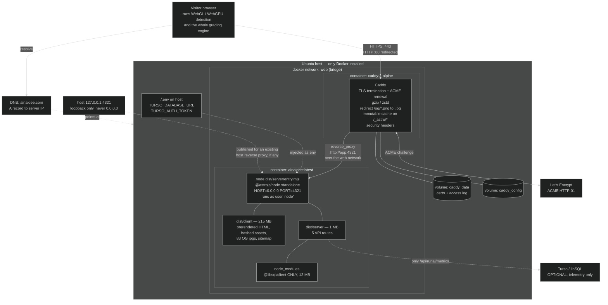
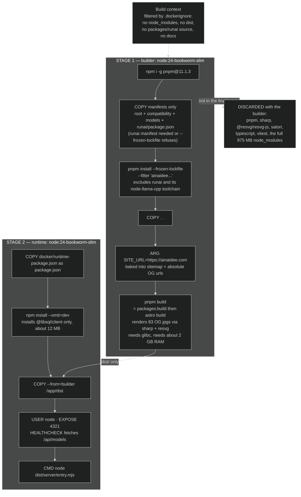
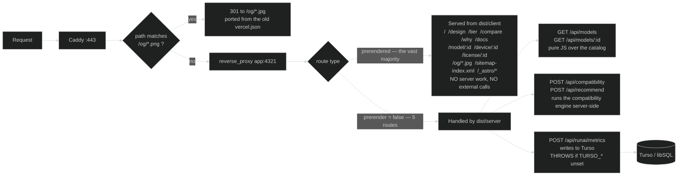
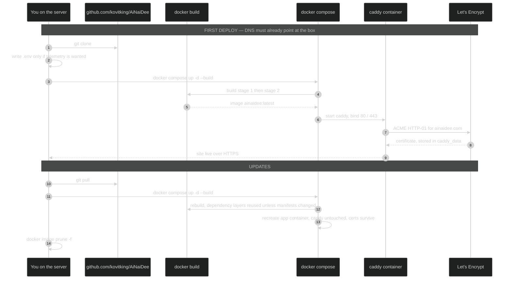

# AiNaiDee — server deployment architecture

Low-level view of what runs on the Ubuntu box. Procedure and open questions are in
[`deploy.md`](./deploy.md).

---

## 1. Runtime topology

What exists on the server once `docker compose up -d` has run.

**Why the app publishes on loopback.** Caddy reaches it over the compose network, so the port
does not need to face the internet. Publishing it on `127.0.0.1` anyway means that if the box
already runs nginx or Traefik on 80/443, you delete the `caddy` service and point the existing
proxy at `127.0.0.1:4321` with no other change.

---

## 2. Image build pipeline

Two stages. Everything heavy is discarded with the builder.

**The rule that keeps this working:** the runtime image contains only what
`dist/server/entry.mjs` actually imports. Today that is one package. Add a server-side
dependency and you must add it to `docker/runtime-package.json`, or the container starts fine
and then crashes the first time that code path runs.

---

## 3. Request routing — what needs the server and what does not

**The consequence worth remembering:** hardware detection and grading run in the visitor's
browser, not here. The five API routes above are the only reason a server process exists at
all. Drop the public JSON API and this becomes a static site that any web server can host with
no Node at runtime — see the last section of `deploy.md`.

---

## 4. Deploy and update flow

---

## Failure modes to check first

| Symptom | Almost certainly |
|---|---|
| Caddy exits immediately on start | Something else already owns :80/:443 — drop the caddy service, use the existing proxy |
| Certificate never issued | DNS not propagated yet, or :80 blocked by a firewall — ACME needs it |
| Build killed partway through | Out of RAM during OG rendering — needs about 2 GB |
| Build fails on an Astro internal import | The adapter was upgraded past **10.1.0** |
| Site up but a POST API 500s | `TURSO_*` unset, or a new server dep missing from `docker/runtime-package.json` |
| Links and OG images point at the wrong domain | `SITE_URL` is baked in at build time — rebuild, do not just restart |
