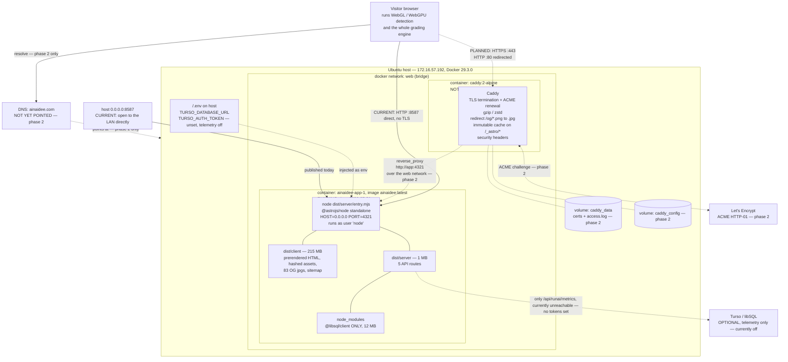
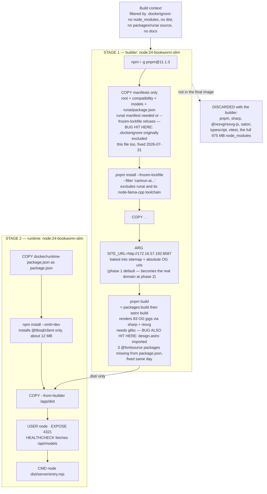
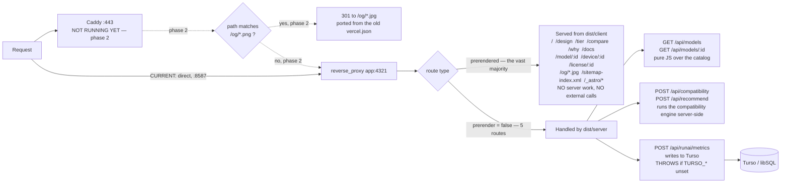
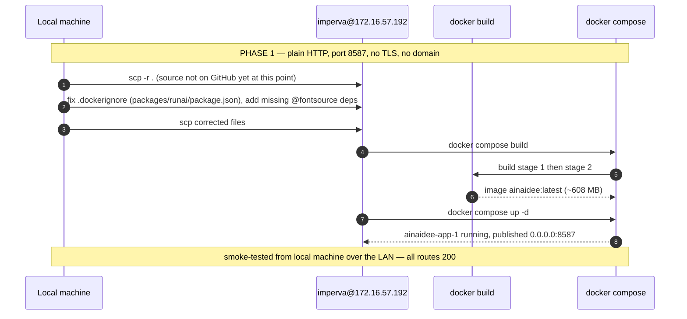
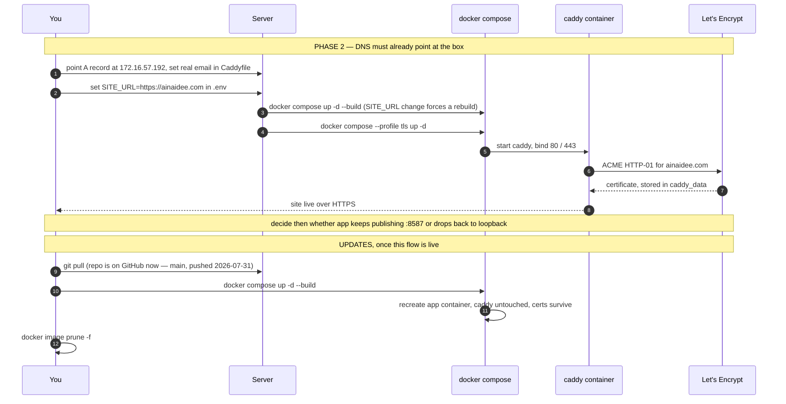

# AiNaiDee — server deployment architecture

Low-level view of what runs on the Ubuntu box. Procedure and open questions are in
[`deploy.md`](./deploy.md). The blog (Ghost, planned, not built) has its own diagram set in
[`blog-architecture.md`](./blog-architecture.md) — it isn't in the diagrams below.

**This diagram set originally described a single day-one deploy with TLS from the start. What's
actually running (2026-07-31) is phase 1 only — plain HTTP on `172.16.57.192:8587`, no Caddy, no
domain.** Diagram 1 below is marked up to show current-vs-planned. Diagrams 2–3 (build pipeline,
request routing) describe the app itself and are accurate as-is. Diagram 4 (deploy flow) is split
into what actually happened and what phase 2 will add.

---

## 1. Runtime topology

**Current (phase 1):** everything in this diagram except the `caddyc` subgraph and its edges is
running. The app container publishes directly on `0.0.0.0:8587`, not the loopback `127.0.0.1:4321`
described below — there is no reverse proxy in front of it yet, by design, so it can be reached
straight from the LAN while DNS and TLS are still pending. `dns` and `le` are aspirational: the
site is reached by bare IP, not `ainaidee.com`.

**Planned (phase 2):** once DNS points at the box, `docker compose --profile tls up -d` starts
Caddy. At that point `app` should go back to publishing on loopback only (`127.0.0.1:4321`) and
`8587` can be dropped, since Caddy reaches `app` over the compose network regardless.

**Why the app is on `0.0.0.0:8587` right now instead of loopback.** Phase 1 was explicitly asked
for as plain HTTP, no reverse proxy, reachable immediately — so the app is exposed directly rather
than waiting on Caddy/TLS. This is the thing to revisit at phase 2: either rebind `app` to
loopback once Caddy takes the public ports, or keep `8587` open as a secondary plain-HTTP entry
point. Not yet decided.

---

## 2. Image build pipeline

Two stages. Everything heavy is discarded with the builder. **This build has now actually run**
(2026-07-31) — image `ainaidee:latest`, ~608 MB, all 83 OG images rendered, ~80s on the server.

**The rule that keeps this working:** the runtime image contains only what
`dist/server/entry.mjs` actually imports. Today that is one package. Add a server-side
dependency and you must add it to `docker/runtime-package.json`, or the container starts fine
and then crashes the first time that code path runs. Confirmed against the real build output —
`@libsql/client` is the only non-builtin import.

---

## 3. Request routing — what needs the server and what does not

**Currently (phase 1), Caddy isn't running, so requests hit `app:4321` (published as
`172.16.57.192:8587`) directly — no TLS, no `/og/*.png` → `.jpg` redirect yet.** The routing
logic below is unchanged; only the Caddy hop at the top is inactive for now.

**The consequence worth remembering:** hardware detection and grading run in the visitor's
browser, not here. The five API routes above are the only reason a server process exists at
all. Drop the public JSON API and this becomes a static site that any web server can host with
no Node at runtime — see the last section of `deploy.md`.

---

## 4. Deploy and update flow

**What actually happened (phase 1, 2026-07-31)** — no git access from the server yet, no Caddy:

**What phase 2 will add** — once DNS and an email address are ready:

---

## Failure modes to check first

| Symptom | Almost certainly |
|---|---|
| `COPY packages/runai/package.json` fails during build | `.dockerignore` excludes that file — it needs `packages/runai/*` + `!packages/runai/package.json`, not a blanket `packages/runai` entry. Hit and fixed 2026-07-31. |
| Rollup `failed to resolve import` for a page-level import | Something a page imports isn't a declared dependency in `package.json` — hit for `design.astro`'s `@fontsource/*` imports, fixed 2026-07-31 |
| Caddy exits immediately on start | Not applicable yet — Caddy isn't running in phase 1. Once enabled: something else already owns :80/:443 — check `docker ps` on the shared box first, drop the caddy service if so |
| Certificate never issued (phase 2) | DNS not propagated yet, or :80 blocked by a firewall — ACME needs it |
| Build killed partway through | Out of RAM during OG rendering — needs about 2 GB. Not observed on this box (12 GB, build completed in ~80s) |
| Build fails on an Astro internal import | The adapter was upgraded past **10.1.0** |
| Site up but a POST API 500s | `TURSO_*` unset, or a new server dep missing from `docker/runtime-package.json` — currently expected for `/api/runai/metrics` since telemetry is off |
| Links and OG images point at the wrong domain | `SITE_URL` is baked in at build time — rebuild, do not just restart. Currently baked as `http://172.16.57.192:8587`, by design, until phase 2 |
